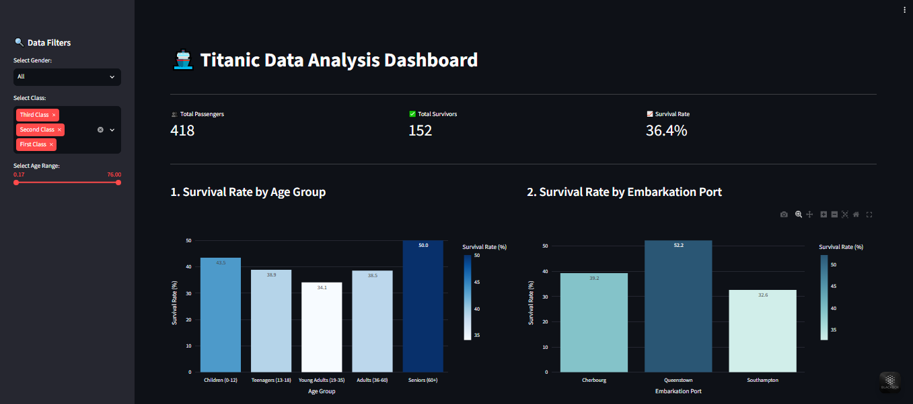
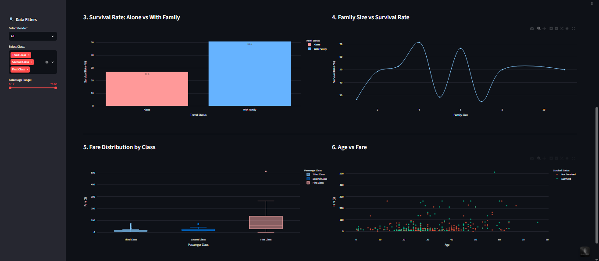

# 🚢 Titanic Data Analysis Dashboard

An interactive web dashboard built with **Python**, **Streamlit**, **Pandas**, and **Plotly** to analyze and visualize the famous Titanic dataset. This application provides insights into passenger demographics, ticket fares, and key factors influencing survival rates through dynamic charts and key performance indicators (KPIs).

---

## Features

- **Data Cleaning & Feature Engineering:**
  - Handled missing values (e.g., age imputation, embarkation ports).
  - Derived meaningful features like family size and passenger groupings for deeper analysis.

- **Key Performance Indicators (KPIs):**
  - High-level metric cards showing total passengers, survival rate, total survived/deceased, and average ticket fare.

- **Interactive Filters & Slicers:**
  - Sidebar filters allowing users to slice data dynamically by Passenger Class (`Pclass`), Gender (`Sex`), Embarkation Port (`Embarked`), Age Range, and Fare Range.

- **Dynamic Visualizations (6 Interactive Charts):**
  1. **Survival Rate by Gender & Class:** Bar chart exploring the socio-economic and gender impact on survival.
  2. **Age Distribution:** Histogram showing the age profile of passengers vs. survival status.
  3. **Survival by Family Size:** Analyzing how traveling alone vs. with family affected survival chances.
  4. **Fare Distribution:** Boxplot/Histogram inspecting ticket prices across classes and survival outcomes.
  5. **Embarkation Port Analysis:** Comparing passenger counts and survival rates across different departure ports.
  6. **Feature Correlation / Heatmap:** Visualizing relationships between numerical variables.

---
## 📸 Dashboard Screenshots

**1. Overview & KPIs**


**2. Detailed Analytics**

---

## Tech Stack

- **Language:** Python 3.x
- **Web Framework:** [Streamlit](https://streamlit.io/)
- **Data Manipulation:** [Pandas](https://pandas.pydata.org/), [NumPy](https://numpy.org/)
- **Data Visualization:** [Plotly Express](https://plotly.com/python/)

---

## Getting Started

Follow these instructions to run the dashboard locally on your machine.

### Prerequisites

Make sure you have **Python 3.10+** and **Git** installed on your system.

### Installation & Execution

1. **Clone the repository:**
   ```bash
   git clone [https://github.com/Raghad-Waleed/Titanic-Data-Analysis-Dashboard.git](https://github.com/Raghad-Waleed/Titanic-Data-Analysis-Dashboard.git)
   ```
2. **Navigate to the project directory:**

    ```Bash
    cd Titanic-Data-Analysis-Dashboard
    ```
3. **Install the required packages:**
  
    ```Bash
    pip install streamlit pandas plotly
    ```
4. **Run the Streamlit application:**

    ```Bash
    python -m streamlit run app.py
    ```
    
5. **Access the Dashboard:**

      Open your browser and navigate to `http://localhost:8501`
